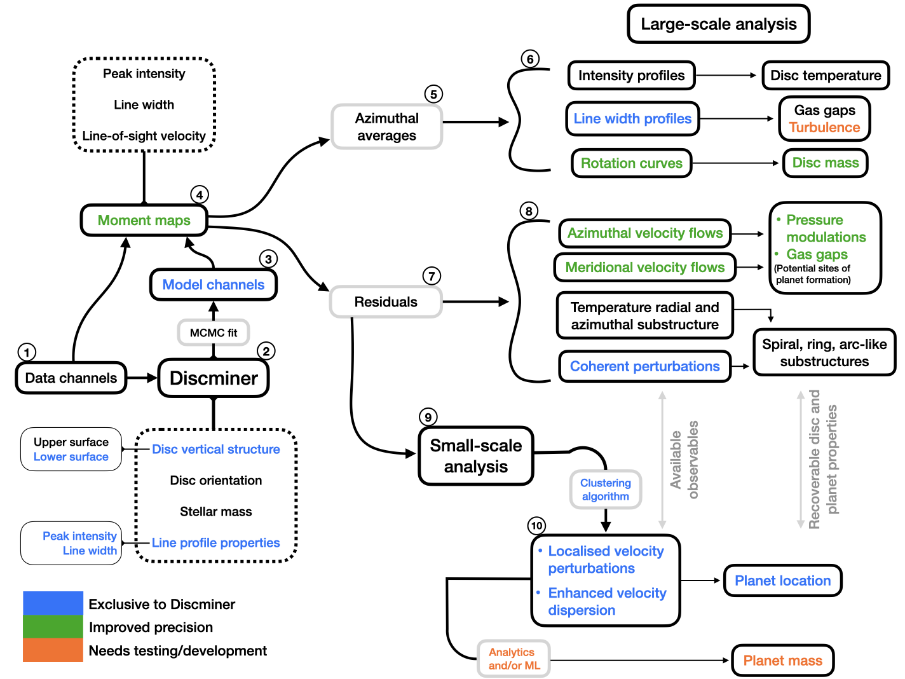

<p align="center">
</p>

<h2 align="center">The Channel Map Modelling Code</h2>

<div align="center">
<a href="https://github.com/andizq/discminer/blob/main/LICENSE"></a>
<a href="https://github.com/andizq/discminer/pulls"></a>
<a href="https://github.com/andizq"></a>
<a href="https://github.com/psf/black"></a>
</div>


<div align="center">
  Welcome to the discminer repository! Looking for quick examples and tutorials? Check out the <mark>example/</mark> folder.
  <br />
  <a href="https://github.com/andizq/discminer/issues/new?assignees=&labels=bug&title=bug%3A+">Report a Bug</a>
  ·
  <a href="https://github.com/andizq/discminer/issues/new?assignees=&labels=enhancement&title=feature%3A+">Request a Feature</a>
  ·
  <a href="https://github.com/andizq/discminer/issues/new?assignees=&labels=question&title=question%3A+">Ask a Question</a>
</div>

- Model channel maps from molecular line emission of discs by fitting intensity **and** rotation velocity
- Analyse the disc's dynamics by modelling Keplerian motion, and optionally pressure support + self-gravity
- Investigate the disc vertical structure by modelling front and back side emission surfaces
- Compute moment maps that accurately capture complex line profile morphologies
- Extract rotation curves, radial and meridional velocities, intensity, and line width profiles
- Identify velocity and intensity substructures, and examine their coherence and degree of localisation
- Support non-axisymmetric models; all attributes can be described in three-dimensional coordinates




## Mining tools

Discminer offers a wide range of analysis and visualisation tools to fully explore the physical and dynamical structure of discs.


### cube

- Compute moment maps that accurately capture complex line profile morphologies.
- Output moment maps include **peak intensity**, **line width**, **line slope**, and **centroid velocity**.
- Easily clip, downsample, and convert data to brightness temperature units.
- Quickly visualise model versus data channels and interactively extract spectra.

### rail

- Extract azimuthal and radial profiles of intensity, line width, and velocity from moment maps.
- Compute rotation curves and decompose disc velocities into their three-dimensional components.
- Identify large-scale structures and quantify their pitch angle, width, extent, and degree of coherence.

### pick

- Identify small-scale perturbations and estimate their degree of localisation.

### plottools

- Customise intensity channels, moments, and residual maps.
- Use sky or disc projections interchangeably for improved visualisation of features.
- Easily overlay disc geometry (considering orientation and vertical structure) onto any observable product.
- Load in 1D profiles or 2D maps from external data e.g. to highlight the presence of dust substructures.


## Installation

```bash
pip install discminer
```

To upgrade the code,

```bash
pip install -U discminer
```

#### Optional dependencies

- [termplotlib](https://pypi.org/project/termplotlib)
- [FilFinder](https://pypi.org/project/fil-finder)
- [schwimmbad](https://pypi.org/project/schwimmbad)
- [ipython](https://ipython.readthedocs.io/en/stable)

## How to use

You can find practical examples demonstrating the main functionality of the code in the `./example` folder of this repository.

To run the examples on your local machine, clone this repository and follow the instructions provided in the README file,

```bash
git clone https://github.com/andizq/discminer.git
cd discminer/template
less README.rst
```

## Citation

If you find `discminer` useful for your research please cite the work of [Izquierdo et al. 2021](https://ui.adsabs.harvard.edu/abs/2021A%26A...650A.179I/abstract),

```latex
@ARTICLE{2021A&A...650A.179I,
       author = {{Izquierdo}, A.~F. and {Testi}, L. and {Facchini}, S. and {Rosotti}, G.~P. and {van Dishoeck}, E.~F.},
        title = "{The Disc Miner. I. A statistical framework to detect and quantify kinematical perturbations driven by young planets in discs}",
      journal = {\aap},
     keywords = {planet-disk interactions, planets and satellites: detection, protoplanetary disks, radiative transfer, Astrophysics - Earth and Planetary Astrophysics, Astrophysics - Solar and Stellar Astrophysics},
         year = 2021,
        month = jun,
       volume = {650},
          eid = {A179},
        pages = {A179},
          doi = {10.1051/0004-6361/202140779},
archivePrefix = {arXiv},
       eprint = {2104.09596},
 primaryClass = {astro-ph.EP},
       adsurl = {https://ui.adsabs.harvard.edu/abs/2021A&A...650A.179I},
      adsnote = {Provided by the SAO/NASA Astrophysics Data System}
}
```
