Quick Example
-------------

The following example is based on 12CO J=2-1 line data from the disc of MWC480, as observed by the ALMA large program MAPS. The parameters provided in the accompanying '.txt' file here were obtained from previous modelling of this object using ``discminer`` with the fitting script available in the ``./fit`` folder. Since the ``discminer`` model assumes a smooth and Keplerian disc, any differences observed in the comparison between the data and the model primarily trace deviations from Keplerian rotation and intensity perturbations driven by variations in temperature, turbulence, and density within the gas disc.

To get started, let's download and prepare (clip and downsample) the datacube that will be used throughout this guide:

.. code-block:: bash

   bash download-MAPS.sh #Download MWC480 12CO data from the MAPS website
   python prepare_data.py #Clip and downsample cube

Here is a preview of selected channel maps from this disc and tracer,

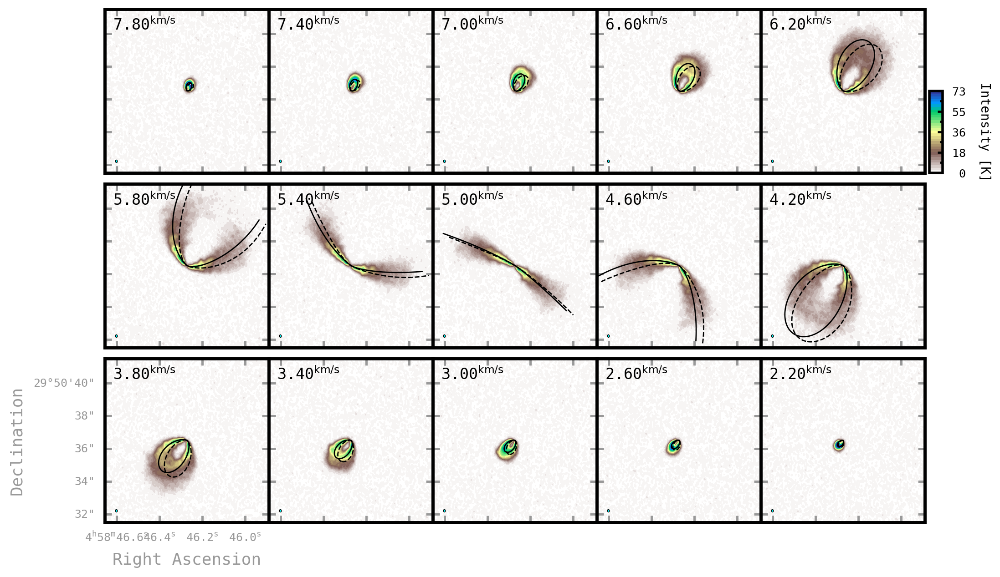

Mining scripts
==============

Once the code is successfully installed, you'll have access to analysis modules via the command line using the ``discminer`` alias. These modules will guide you through the analysis of the structure and dynamics of your disc. A list of all analysis modules and their description can be shown by typing ``discminer -h``:

   .. code-block:: bash
		   
		   usage: discminer [-h]
		   {parfile,channels,moments1d,moments2d,parcube,channels+peakint,attributes,radprof,radprof+wedge,azimprof,spectra,moment+residuals,moment+offset,residuals+deproj,residuals+all,gradient,isovelocities,pv}
                   ...
		            Select a subscript to run.
	parfile             Make JSON parameter file based on input log_pars.txt and prepare_data.py
	channels            Make model channel maps and compare to data
	moments1d           Make (gaussian, bell, or quadratic) moment maps and save output into .fits files
	moments2d           Make (double Gauss or double Bell) moment maps and save output into .fits files
	parcube             Show cube reconstructed from fit parameters vs data cube
	channels+peakint    Show Data vs Model channel maps, peak intensities, and residuals
	attributes          Show model attributes (z, v, I, Lw) as a function of radius
	radprof             Extract and show radial profiles from moment maps AND residuals
	radprof+wedge       Extract and show radial profiles from moment residuals within specific wedges
	azimprof            Extract and show azimuthal profiles from moment maps OR residuals
	spectra             Extract and show line profiles along a specific annulus, every 30 deg
	moment+residuals    Show Data vs Model moment map and residuals
	moment+offset       Show moment map and a zoom-in illustrating offset from the centre
	residuals+deproj    Show residuals from a moment map, deprojected onto the disc reference frame
	residuals+all       Show ALL moment map residuals, deprojected onto the sky OR disc reference frame
	gradient            Show peak, radial AND/OR azimuthal gradient from residual maps
	isovelocities       Show Data vs Model isovelocity contours
	pv                  Show PV diagram extracted along a specific axis

	optional arguments:
	-h, --help            show this help message and exit
  

Before diving into the analysis, we first need to generate a formatted file containing some basic metadata and the model parameters.

.. code-block:: bash

   discminer parfile

Next, two additional *mandatory* scripts must be executed to generate the model channel maps and moment maps required for the rest of the analysis.

.. code-block:: bash

   discminer channels
   discminer moments1d -k gaussian

The former command interactively displays the data and best-fit model channel maps while also storing the residuals obtained by subtracting the model channel intensities from the data.

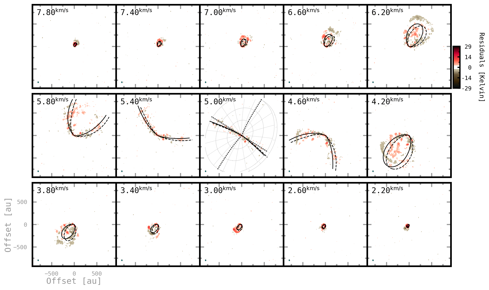

You can use the interactive window to quickly examine the data and model channels and visualize spectra from specific pixels or regions of the image.

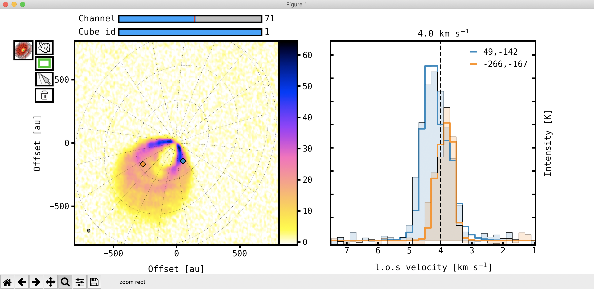
   
The latter command produces three different types of moment maps: (a) **peak intensities** (b) **line widths** and (c) **centroid velocities**, which correspond to the attributes of Gaussian kernels (in this case) fitted along the velocity axis of the input data and model cubes. You can visualise the resulting moment maps in various ways,

.. code-block:: bash

   discminer moment+offset -m peakintensity 
   discminer moment+residuals -m velocity 
   discminer moment+residuals -m linewidth 

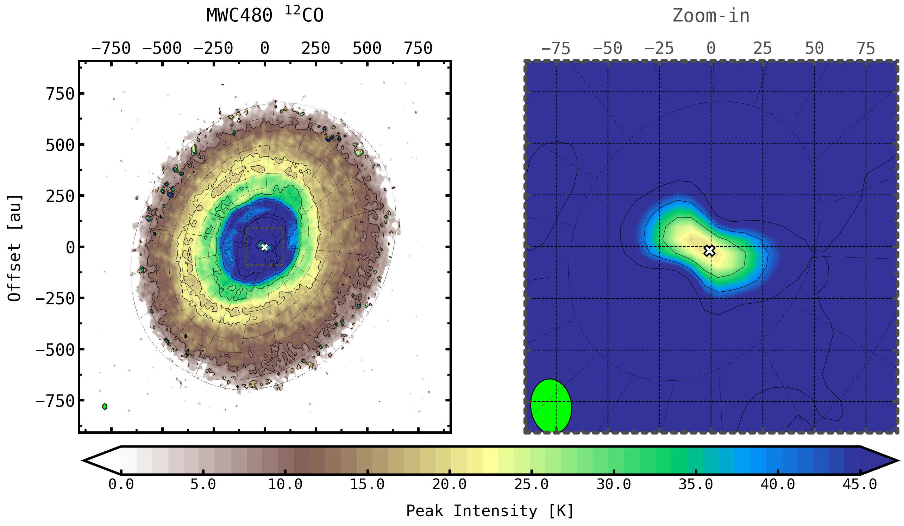
      
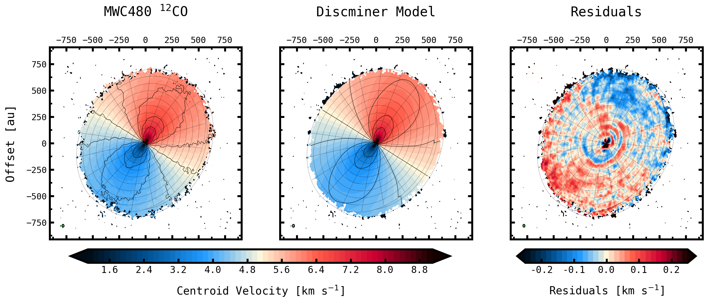
	   
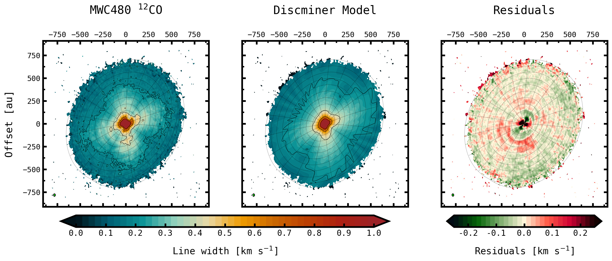
   
- **TIP**: Most of the *mining* scripts support multiple arguments that allow you to perform various tasks directly from the command line. You can view a list of these arguments by using the ``-h`` flag preceeded by the analysis module, for example: ``discminer moment+offset -h``, which will produce the following output,

   .. code-block:: bash

      Show moment map and a zoom-in illustrating offset from the centre

      optional arguments:
		   -h, --help            show this help message and exit
		   -scontours SHOW_CONTOURS, --show_contours SHOW_CONTOURS
		   Overlay moment map contours? DEFAULTS to 1.
		   -zoom ZOOM_SIZE, --zoom_size ZOOM_SIZE
                   Physical size of the zoom-in region. DEFAULTS to 100 au.
		   -m {velocity,linewidth,lineslope,peakint,peakintensity,v0r,v0phi,v0z,vr_leftover,delta_velocity,delta_linewidth,delta_peakintensity,reducedchi2}, --moment {velocity,linewidth,lineslope,peakint,peakintensity,v0r,v0phi,v0z,vr_leftover,delta_velocity,delta_linewidth,delta_peakintensity,reducedchi2}
                   Type of moment map to be analysed. DEFAULTS to 'velocity'
		   -k {gauss,gaussian,bell,quadratic,dgauss,doublegaussian,dbell,doublebell}, --kernel {gauss,gaussian,bell,quadratic,dgauss,doublegaussian,dbell,doublebell}
                   Kernel used for line profile fit and calculation of moment maps. DEFAULTS to 'gaussian'
		   -ki {mask,sum}, --kind {mask,sum}
                   Method for merging upper and lower surface kernel profiles. DEFAULTS to 'mask'
		   -s {up,upper,low,lower,both}, --surface {up,upper,low,lower,both}
                   Use upper or lower surface moment map. DEFAULTS to 'upper'

Carrying on with the tutorial, you may want to take a quick look at the radial dependence of the main model attributes retrieved for both the upper and lower emitting surfaces of the disc using:

.. code-block:: bash

   discminer attributes

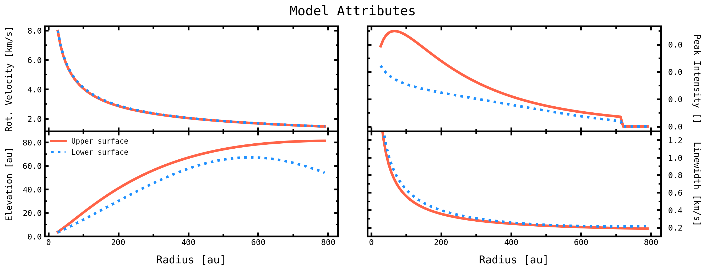
	   
- **TIP**: You can easily access the different attributes and methods associated with a given variable by running your scripts in an ``IPython`` terminal or a Jupyter notebook,

   .. code-block:: bash

      ipython
      !discminer attributes
      model.skygrid #print dictionary with sky grid information

Returning to residual maps, it is also possible to display them in Cartesian or polar coordinates in the disc reference frame. Internally, this requires knowledge of the disc's vertical structure and orientation in order to translate celestial coordinates into disc coordinates. The ``discminer`` best-fit model provides this information.

.. code-block:: bash

   discminer residuals+all -c disc #Plot a summary of all residuals in disc coordinates
   
   discminer residuals+deproj -m peakint
   discminer residuals+deproj -m linewidth
   discminer residuals+deproj -m velocity
   discminer residuals+deproj -m velocity -p polar

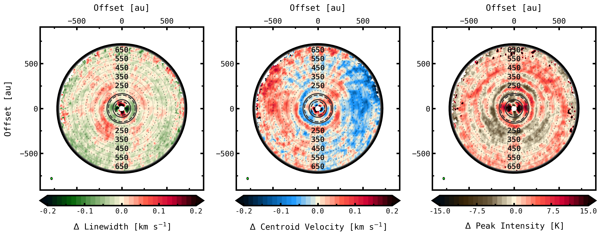

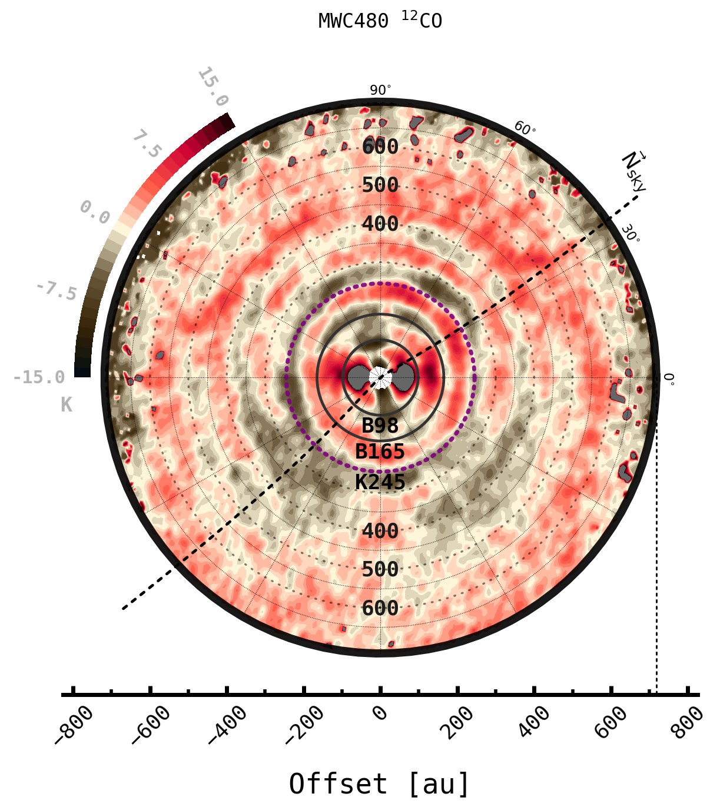
	   
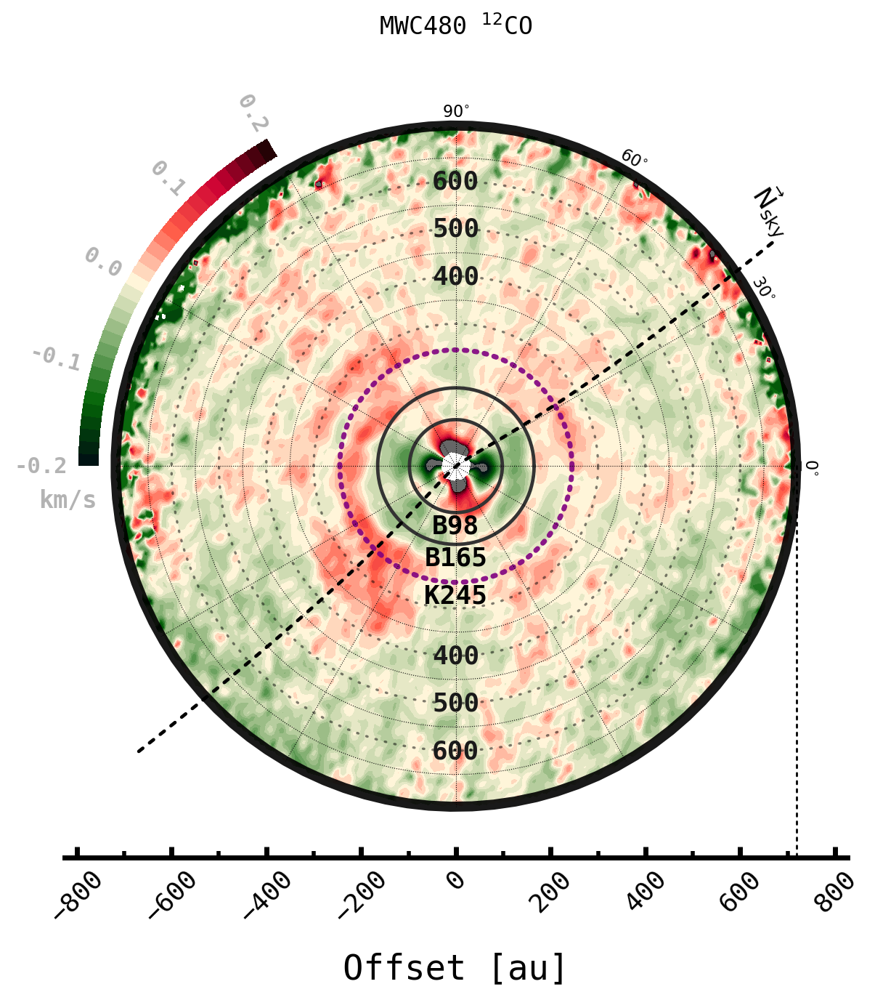
	   
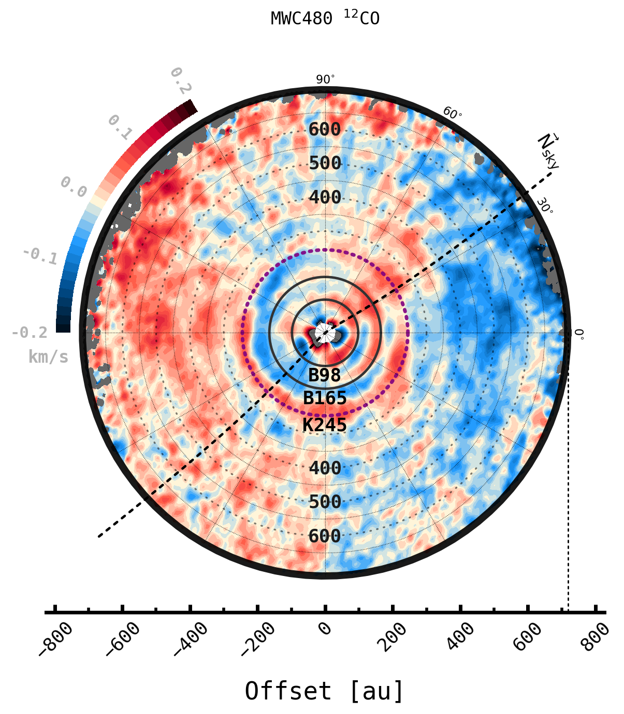
	   
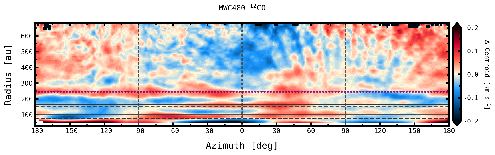
 

Velocity and intensity profiles
===============================

With ``discminer``, you can also extract azimuthally averaged radial profiles of (a) **velocity**; to investigate azimuthal, radial, and vertical gas flows in your disc, (b) **intensity**; which gives access to the overall disc temperature and density structure, and (c) **line width**, which traces thermal and non-thermal fluctuations, as well as surface density variations probed by optically thick lines. 

The following command produces model and data rotation curves, as well as radial profiles of **dvphi** to quantify azimuthal velocity flows relative to Keplerian rotation, and **vr** and **vz** to highlight radial and vertical flows possibly associated with meridional circulation of material, winds, or even planet-driven buoyancy spirals.

.. code-block:: bash

   discminer radprof -vp 1 -m velocity 

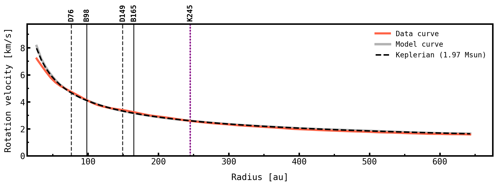
	   
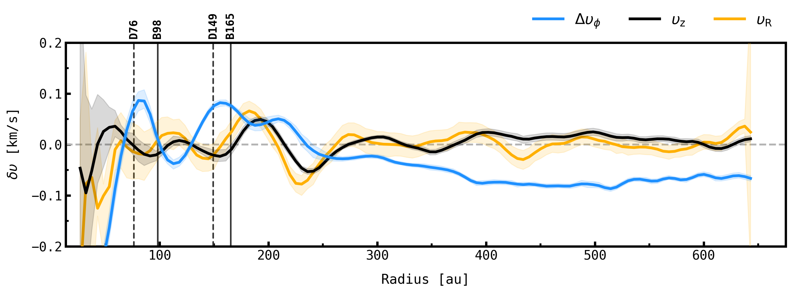

Similarly, the next two lines produce azimuthally averaged profiles of data and model peak intensities and line widths, as well as residual profiles.

.. code-block:: bash

   discminer radprof -m peakint
   discminer radprof -m linewidth		
 
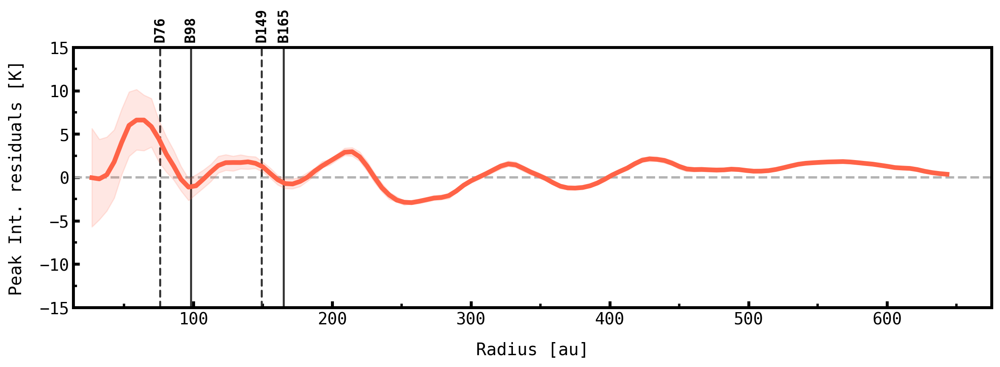
	   
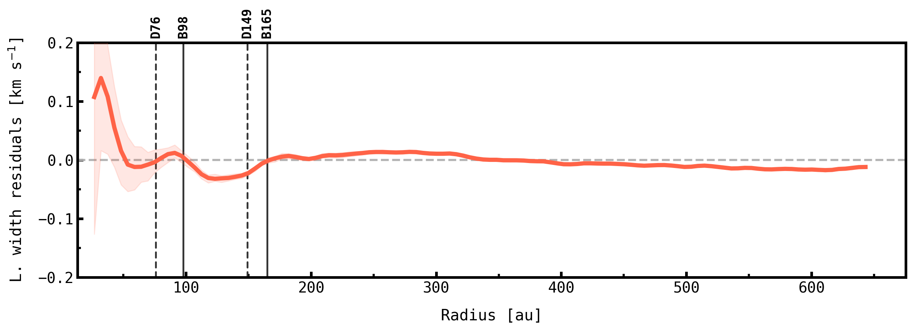

- **TIP**: The ``writetxt`` argument, activated through the ``-w 1`` flag in the command line, is particularly useful for producing .txt outputs of radial profiles for further analysis.
  
  .. code-block:: bash

	discminer radprof -m velocity -w 1
	
	   
Details on the physical interpretation of the substructures identified in this and other discs of the MAPS sample can be found in the work of Izquierdo et al. (2023).
