MWC 480 12CO MAPS example
=========================

This example illustrates a basic ``discminer`` workflow using the MAPS
12CO J=2-1 datacube of the protoplanetary disc around MWC 480. The folder
contains a download script, a data-preparation script, a previously obtained
best-fit parameter file, and the MCMC fitting script used to generate that
parameter file.

The goal is to demonstrate how to go from an observed datacube to model
channel maps, moment maps, residual maps, and radial profiles using the
``discminer`` command-line tools.

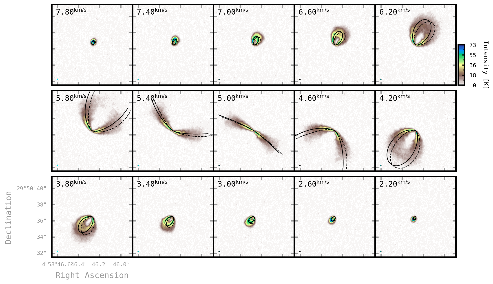

Folder contents
---------------

.. code-block:: text

   mwc480_12co/
   ├── README.rst
   ├── download_MAPS.sh
   ├── prepare_data.py
   ├── log_pars_mwc480_12co_0p2_maps_cube_256walkers_10000steps.txt
   ├── png/
   └── fit/
       ├── README.rst
       └── fit_mc_mwc480.py

Minimal workflow 
----------------

For a quick look through the example, run:

.. code-block:: bash

   bash download_MAPS.sh
   python prepare_data.py
   discminer parfile -o 1
   discminer channels
   discminer moments1d -k gaussian
   discminer moment+residuals -m velocity
   discminer residuals+deproj -m velocity
   discminer residuals+deproj -m velocity -p polar
   discminer radprof -m velocity

This sequence downloads and prepares the data, creates the parameter file,
generates the model cube, extracts moment maps, and inspects the velocity
residuals in both sky/disc coordinates and radial profiles.

Extended Guide
==============

This guide uses optically thick 12CO emission from MWC 480. The adopted
``discminer`` model is intentionally smooth and axisymmetric. Therefore,
structured residuals between the data and the model highlight kinematic deviations
from the adopted Keplerian rotation, but also velocity and line-profile perturbations
caused by changes in temperature, turbulence, density, or local geometry in the
emitting gas.

Download the MAPS datacube
--------------------------

From inside this folder, run:

.. code-block:: bash

   bash download_MAPS.sh

The script downloads the file:

.. code-block:: text

   MWC_480_CO_220GHz.robust_0.5.JvMcorr.image.pbcor.fits

Prepare the datacube
--------------------

.. code-block:: bash

   python prepare_data.py

The preparation script reads the original cube assuming a distance of 162 pc,
clips it spatially, and produces two downsampled versions:

* a moderately downsampled cube for quick prototyping (used in this example);
* a more strongly downsampled cube used by the MCMC fitting script.

Create the Discminer parameter file
-----------------------------------

The ``discminer`` analysis tools require a JSON parameter file generated from
the available ``log_pars.txt`` file and the local ``prepare_data.py`` script.
From inside this folder, run:

.. code-block:: bash

   discminer parfile -o 1

The option ``-o 1`` overwrites any existing ``parfile.json``.

If multiple files are available, the desired ones can be selected explicitly:

.. code-block:: bash

   discminer parfile -o 1 -f log_file2.txt -p prepare_data2.py

Inspect model attributes (Optional)
-----------------------------------

The radial dependence of the best-fit model attributes can be visualized with:

.. code-block:: bash

   discminer attributes

This is useful for a quick inspection of the emitting surfaces and **unconvolved** rotation curve,
peak intensity and linewidth profiles of the best-fit model.

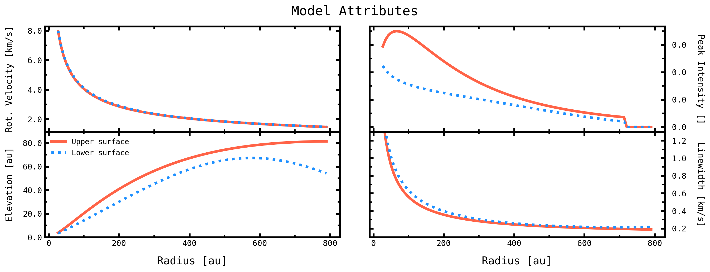
   
Generate model channel maps
---------------------------

Next, generate and inspect the model channel maps with:

.. code-block:: bash

   discminer channels

This is usually the first command to run after ``discminer parfile``, since several subsequent diagnostics depend on the model cube and residuals. Here is a view of the channel map residuals obtained for MWC480:

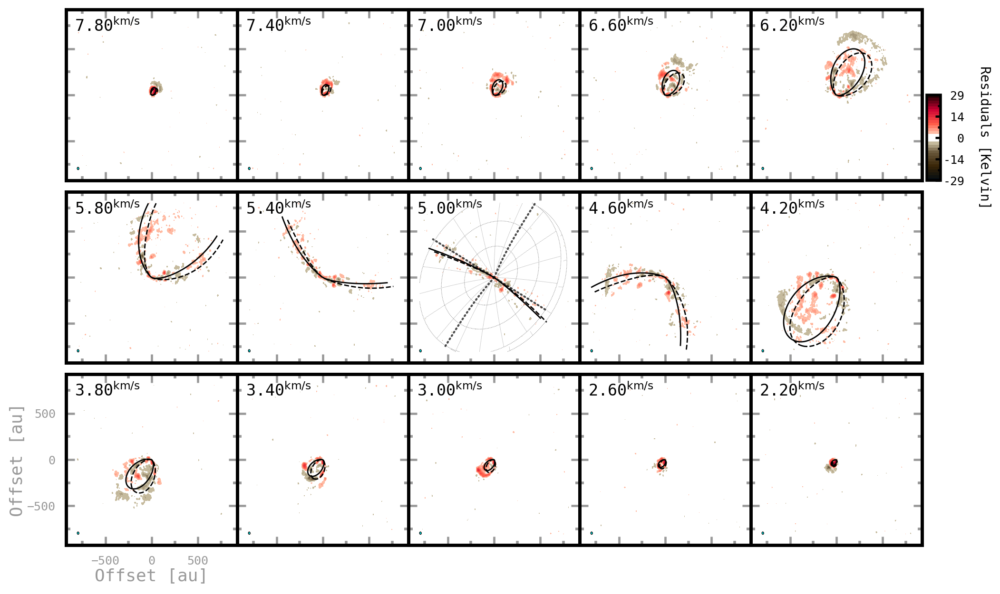
	 
It also triggers an interactive window to compare the channel maps and spectra from the observed data cube with the best-fit model cube.  

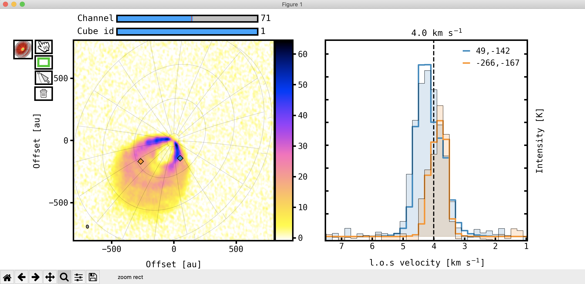

Extract moment maps
-------------------

For this example we adopt a Gaussian kernel to extract peak intensity,
linewidth, and centroid velocity maps from the data and model cubes:

.. code-block:: bash

   discminer moments1d -k gaussian

The resulting FITS files are subsequently used by several analysis commands.

Inspect moment maps and residuals
---------------------------------

Examples of useful commands are:

.. code-block:: bash

   discminer moment+offset -m peakintensity
   discminer moment+residuals -m velocity
   discminer moment+residuals -m linewidth

These functions display the data and model moments and show residual maps for
the selected observables.

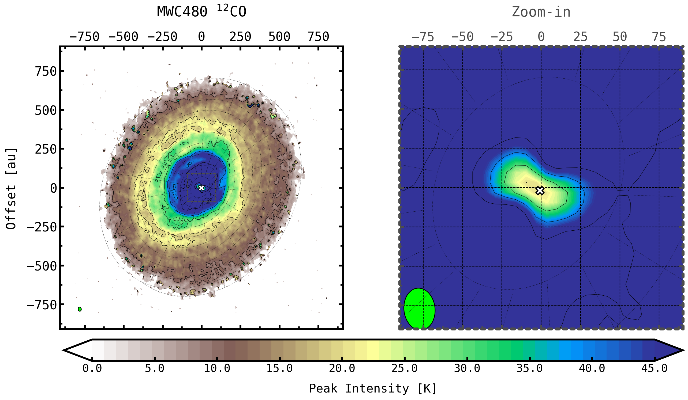
      
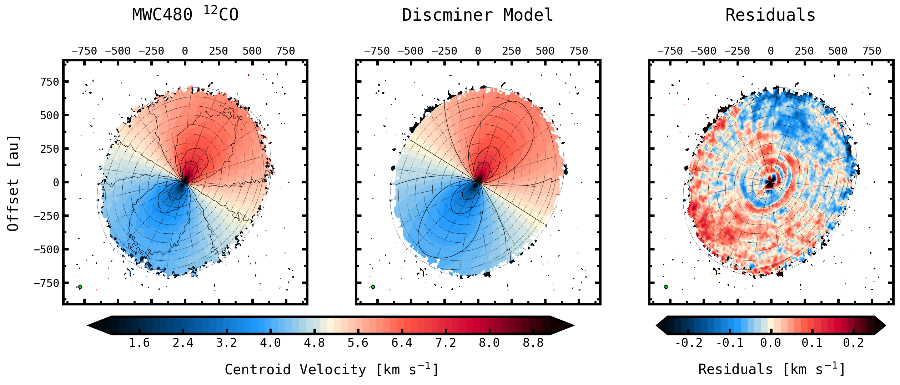
	   
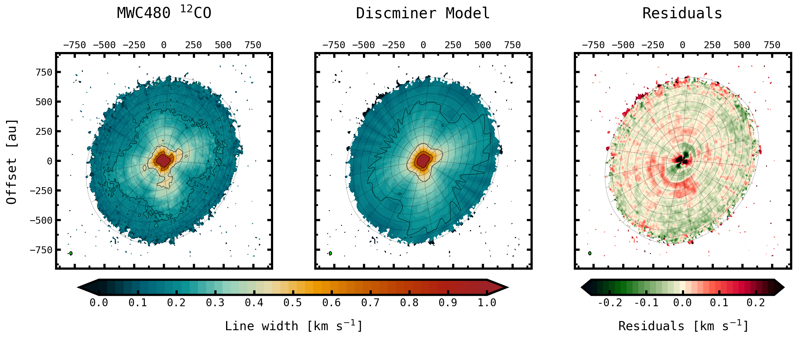

Inspect all residuals in the disc frame
---------------------------------------

Residual maps can also be deprojected onto the disc reference frame:

.. code-block:: bash

   discminer residuals+all -c disc

or inspected one observable at a time:

.. code-block:: bash

   discminer residuals+deproj -m peakint
   discminer residuals+deproj -m linewidth
   discminer residuals+deproj -m velocity
   discminer residuals+deproj -m velocity -p polar

The polar representation is particularly useful for identifying azimuthally
localized perturbations and radial trends.

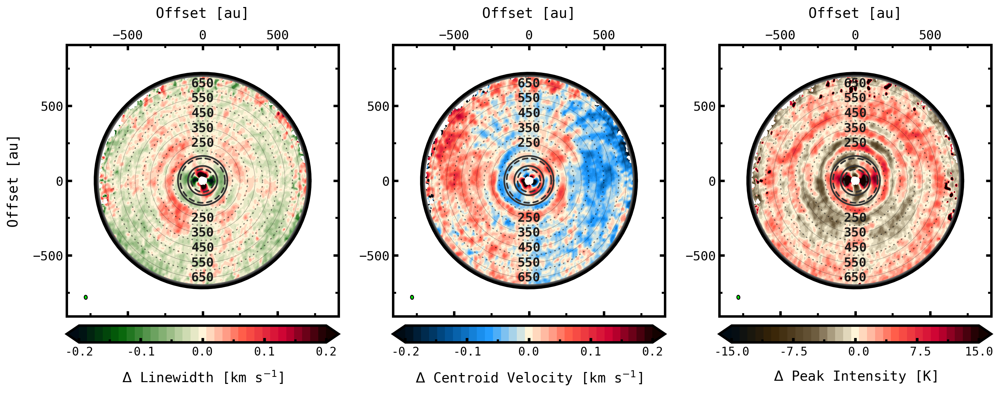

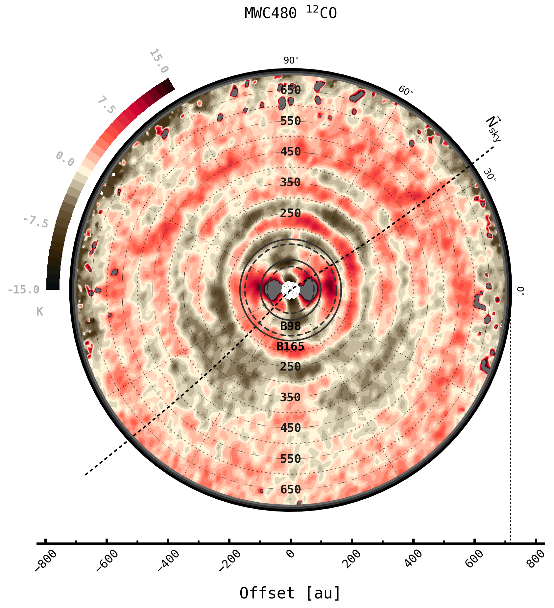
	   
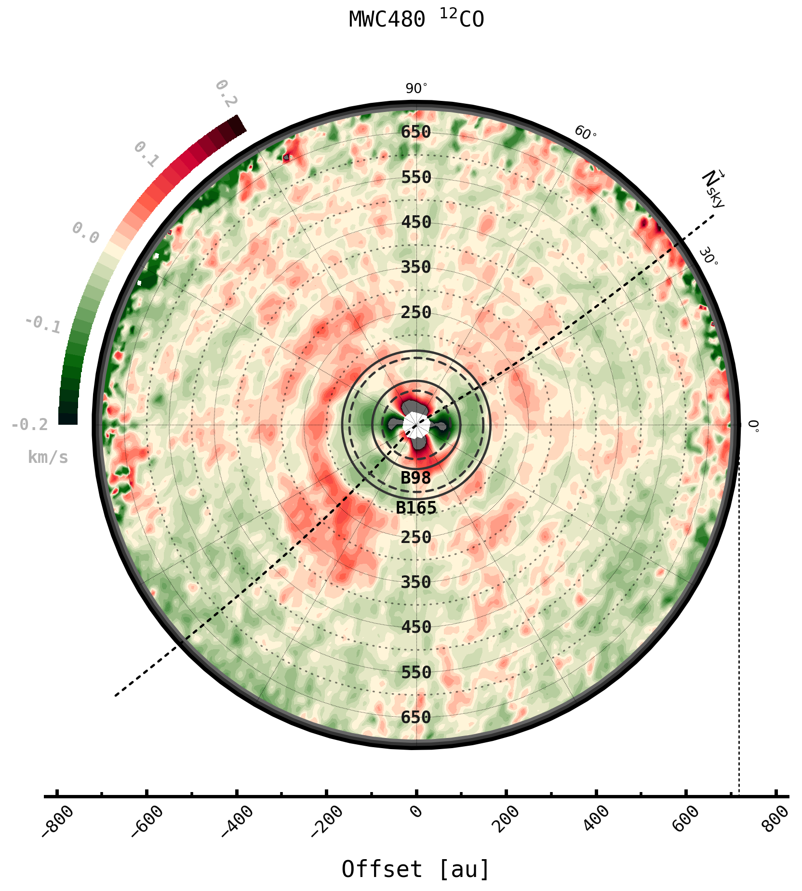
	   
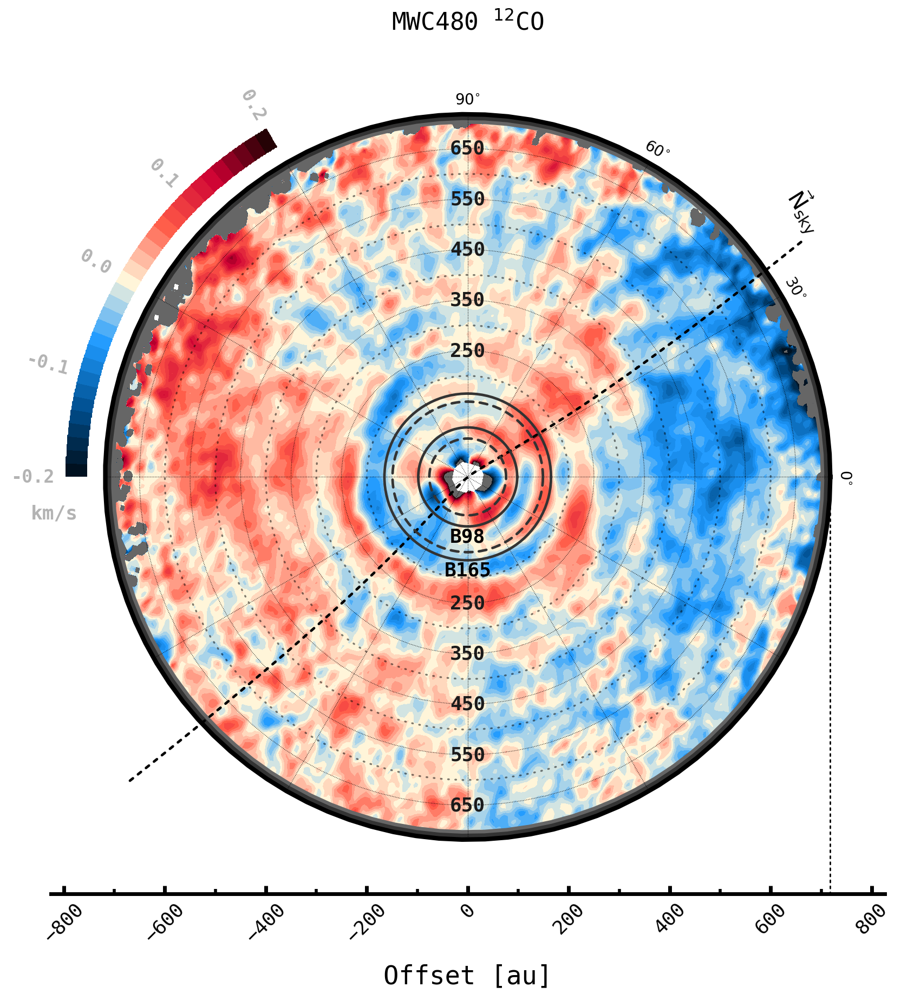
	   
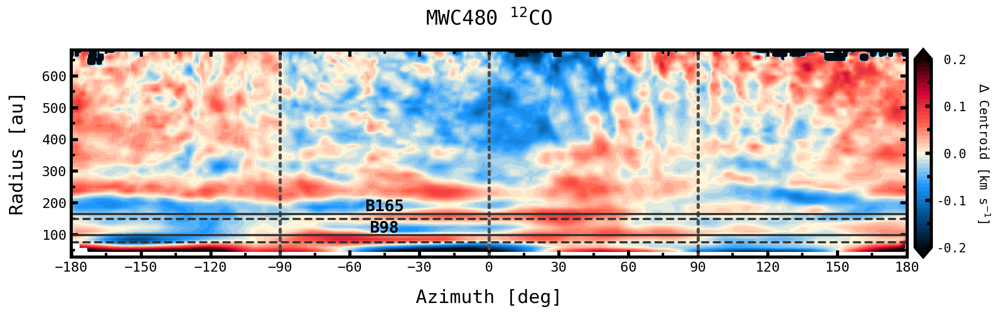
 

Extract radial profiles
-----------------------

Azimuthally averaged radial profiles can be extracted from the fitted moments
and from their residuals. For example:

.. code-block:: bash

   discminer radprof -m velocity
   discminer radprof -m peakint
   discminer radprof -m linewidth

These profiles are useful for quantifying deviations from Keplerian rotation (**dvphi**), as well as
radial (**vr**) and vertical (**vz**) velocity flows, and the radial structure of the line emission.

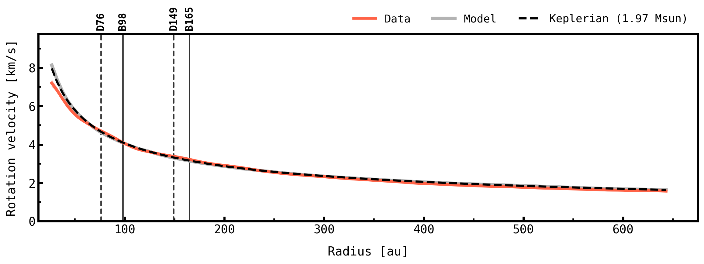
	   
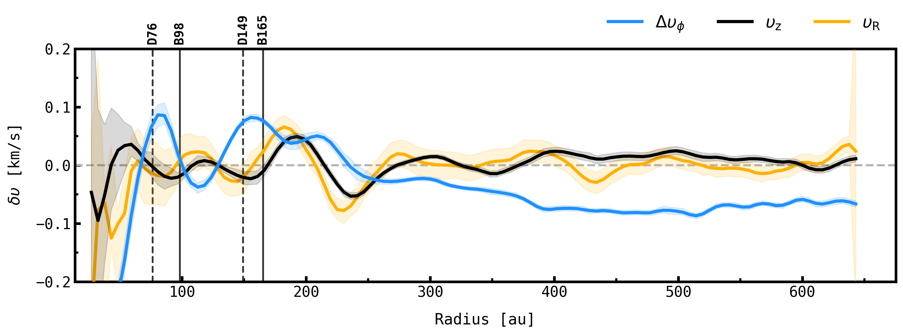

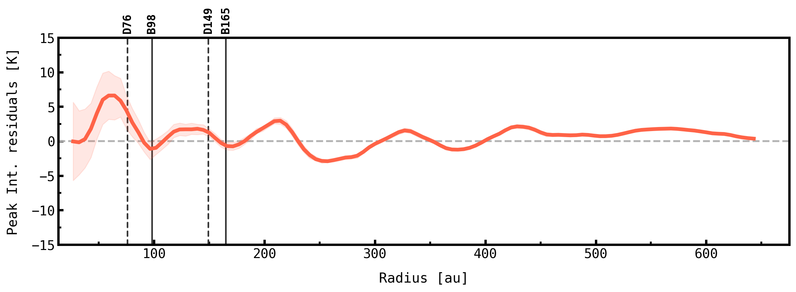
	   
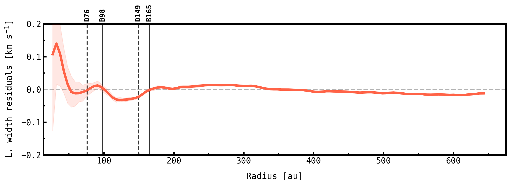

- **TIP:** The ``writetxt`` option, enabled with the ``-w 1`` flag, is particularly useful for exporting radial profiles to plain-text files for further analysis.

  .. code-block:: bash

     discminer radprof -m velocity -w 1
     
Details on the physical interpretation of the substructures identified in this and other discs from the MAPS sample can be found in Izquierdo et al. (2023)_.

.. _Izquierdo et al. (2023): https://ui.adsabs.harvard.edu/abs/arXiv:2304.03607

