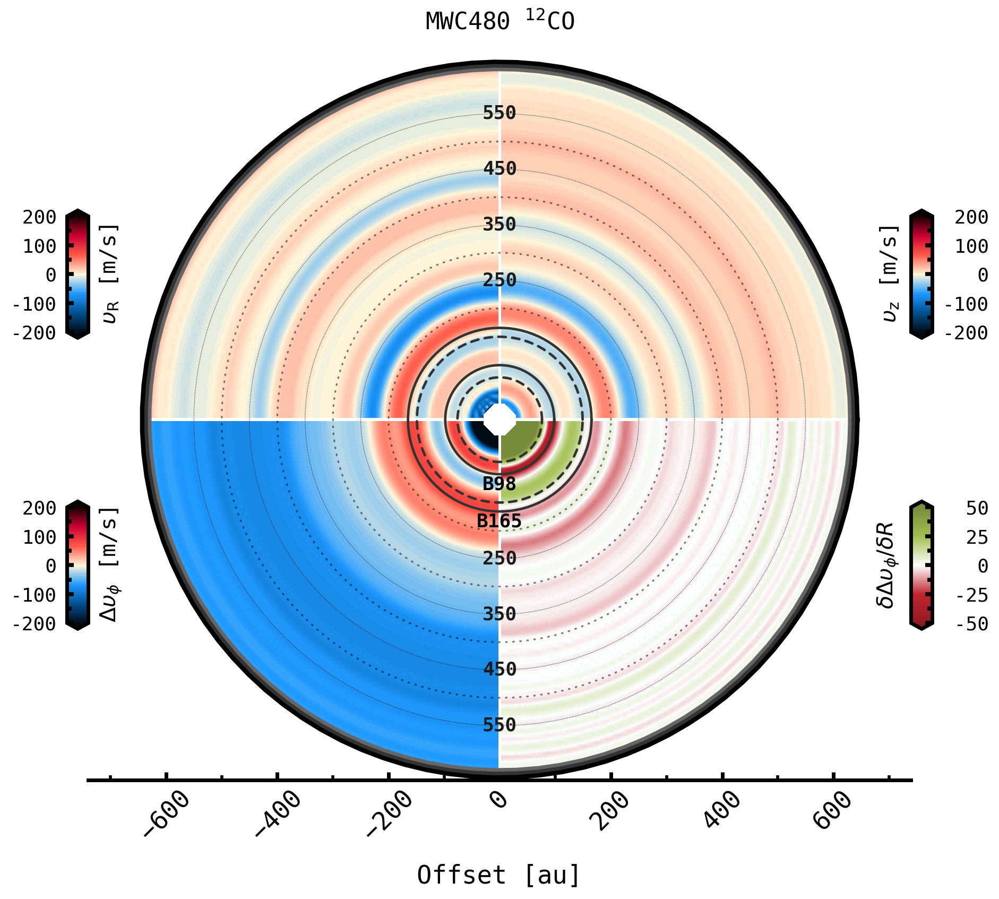

Quick Example
-------------

THIS GUIDE WILL SOON BE DEPRECATED. SEE ``discminer/example/`` FOR AN UPDATED TUTORIAL

The following example is based on 12CO J=2-1 line data from the disc of MWC 480 as observed by the ALMA large program MAPS. The parameters provided in the accompanying '.txt' file here were obtained from previous modelling of this object with ``discminer`` using the fitting script provided in the ``./fit`` folder. Since the ``discminer`` model assumes a smooth and Keplerian disc, any differences that appear from the comparison between the data and the model are mainly tracing deviations from Keplerian rotation and intensity perturbations driven by temperature, turbulence and density variations in the gas disc.

To get started, let's download and prepare (clip and downsample) the datacube that will be used throughout this guide:

.. code-block:: bash

   ./download-MAPS.sh #Download MWC480 12CO data from the MAPS website
   python prepare_data.py #Clip and downsample cube

Here is a quick view of selected channel maps from this disc and tracer,

.. image:: ../images/channel_maps_data.png
   :width: 80 %
   :align: center

Mining scripts
==============

Now, in the ``../_mining`` folder you will find several scripts that will guide you through the analysis of the structure and dynamics of the disc. Those scripts are adapted for reading metadata of the disc of interest from a parameter file generated automatically from command line as follows,

.. code-block:: bash

   python ../_mining/make_parfile.py

Next, two additional *make* scripts must be run in order to produce the model channel and moment maps necessary for the rest of the analysis,

.. code-block:: bash

   python ../_mining/make_channels.py
   python ../_mining/make_single_moments.py -k gaussian

The former command displays the data and best-fit model channel maps interactively, and stores residuals resulting from the subtraction of data and model channel intensities,

.. image:: ../images/channel_maps_residuals.png
   :width: 80 %
   :align: center
	   
You can use the interactive window to have a quick look at the data and model channels and to visualise spectra from specific pixels/regions of the image.

.. image:: ../images/interactive_window_main.png
   :width: 80 %
   :align: center
   
The latter command produces three different types of moment maps: (a) **peak intensities** (b) **line widths** and (c) **centroid velocities**, which are simply the attributes of (in this case) Gaussian kernels fitted along the velocity axis of the input data and model cubes. You can visualise the output moment maps in different ways,

.. code-block:: bash

   python ../_mining/plot_moment+offset.py -m peakintensity #Peak intensity from data alone + zoom-in around central region

   python ../_mining/plot_moment+residuals.py -m velocity #Velocity maps from data and model + residuals
   python ../_mining/plot_moment+residuals.py -m linewidth 

.. image:: ../images/moment+offset_peakintensity_gaussian.png
   :width: 80 %
   :align: center
      
.. image:: ../images/moment+residuals_velocity_gaussian.png
   :width: 80 %
   :align: center
	   
.. image:: ../images/moment+residuals_linewidth_gaussian.png
   :width: 80 %
   :align: center   
   
- **TIP**: The majority of the *mining* scripts support multiple arguments that allow you do different things directly from command line. A list of those arguments can be printed using the ``-h`` flag as in ``python ../_mining/plot_moment+offset.py -h``, which produces the following output,

   .. code-block:: bash

      Plot moment map from data and zoom-in around central region
      
      optional arguments:
		   -h, --help            show this help message and exit
		   -m {velocity,linewidth,lineslope,peakint,peakintensity}, --moment {velocity,linewidth,lineslope,peakint,peakintensity}
		   Type of moment map to be analysed. DEFAULTS to 'velocity'
		   -k {gauss,gaussian,bell,dgauss,doublegaussian,dbell,doublebell}, --kernel {gauss,gaussian,bell,dgauss,doublegaussian,dbell,doublebell}
                   Kernel utilised for line profile fit and computation of moment maps. DEFAULTS to 'gaussian'
		   -ki {mask,sum}, --kind {mask,sum}
                   How the upper and lower surface kernel profiles must be merged. DEFAULTS to 'mask'
		   -s {up,upper,low,lower}, --surface {up,upper,low,lower}
                   Use upper or lower surface moment map. DEFAULTS to 'upper'
			

Carrying on with the tutorial, you can also have a quick look at the radial dependence of the main model attributes retrieved for both upper and lower emitting surfaces of the disc via,

.. code-block:: bash

   python ../_mining/plot_attributes_model.py

.. image:: ../images/model_attributes.png
   :width: 80 %
   :align: center
	   
- **TIP**: You can easily access the different attributes and methods associated with a given variable by running your scripts on an ``IPython`` terminal or in a Jupyter notebook,

   .. code-block:: bash

      ipython
      run ../_mining/plot_attributes_model.py
      model.skygrid #print dictionary with sky grid information

      
Now, it is also possible to display residual maps in Cartesian or polar coordinates in the disc reference frame. Internally, this requires knowledge of the disc vertical structure and orientation in order to translate celestial into disc coordinates; the ``discminer`` best-fit model provides this information.

.. code-block:: bash

   python ../_mining/plot_residuals+all.py -c disc #Plot a summary of all residuals in disc coordinates
   
   python ../_mining/plot_residuals+deproj.py -m peakint
   python ../_mining/plot_residuals+deproj.py -m linewidth
   python ../_mining/plot_residuals+deproj.py -m velocity
   python ../_mining/plot_residuals+deproj.py -m velocity -p polar

.. image:: ../images/residuals_all_gaussian_discframe.png
   :width: 80 %
   :align: center

.. image:: ../images/residuals_deproj_peakintensity_gaussian_cartesian.png
   :width: 60 %
   :align: center
	   
.. image:: ../images/residuals_deproj_linewidth_gaussian_cartesian.png
   :width: 60 %
   :align: center
	   
.. image:: ../images/residuals_deproj_velocity_gaussian_cartesian.png
   :width: 70 %
   :align: center
	   
.. image:: ../images/residuals_deproj_velocity_gaussian_polar.png
   :width: 80 %
   :align: center	   
 
Additionally, you can use these residual maps to reveal asymmetric and localised signatures in the disc by studying the distribution of peak residuals,

.. code-block:: bash

   python ../_mining/plot_peak_residuals.py -m velocity -i 2

.. list-table:: 

    * - .. figure:: ../images/folded_residuals_deproj_velocity_gaussian_cartesian.png

      - .. figure:: ../images/peak_residuals_velocity_gaussian.png
	

Velocity and intensity profiles
===============================

With ``discminer`` you can also compute azimuthally averaged profiles of (a) **velocity**; to investigate azimuthal, radial and vertical gas flows in your disc, (b) **intensity**; which gives access to the overall disc temperature and density structure, and (c) **line width**, which traces thermal and non-thermal fluctuations but also surface density variations probed by optically thick lines. 

The following command produces model and data rotation curves, as well as radial profiles of **dvphi** to quantify azimuthal velocity flows referred to Keplerian rotation, as well as **vr** and **vz** to highlight radial and vertical flows possibly associated with meridional circulation of material, winds, or even planet-driven buoyancy spirals.

.. code-block:: bash

   python ../_mining/plot_radial_profiles.py -m velocity

.. image:: ../images/rotation_curve_velocity_gaussian.png
   :width: 80 %
   :align: center
	   
.. image:: ../images/velocity_components_velocity_gaussian.png
   :width: 80 %
   :align: center

Similarly, the next two lines produce azimuthally averaged profiles of data and model peak intensities and line widths, as well as residual profiles.

.. code-block:: bash

   python ../_mining/plot_radial_profiles.py -m peakint
   python ../_mining/plot_radial_profiles.py -m linewidth		
 
.. image:: ../images/radial_profile_residuals_peakintensity_gaussian.png
   :width: 80 %
   :align: center
	   
.. image:: ../images/radial_profile_residuals_linewidth_gaussian.png
   :width: 80 %
   :align: center

- **TIP**: The ``writetxt`` argument activated with a ``-w 1`` flag in command line is particularly useful to produce .txt outputs of radial profiles for further analysis.
  
  .. code-block:: bash

	python ../_mining/plot_radial_profiles.py -m velocity -w 1
	python ../_mining/plot_velocity_components.py

	
	   
Details on the physical interpretation of the substructures identified in this and in the other discs of the MAPS sample can be found in the work of Izquierdo et al. (2023).
